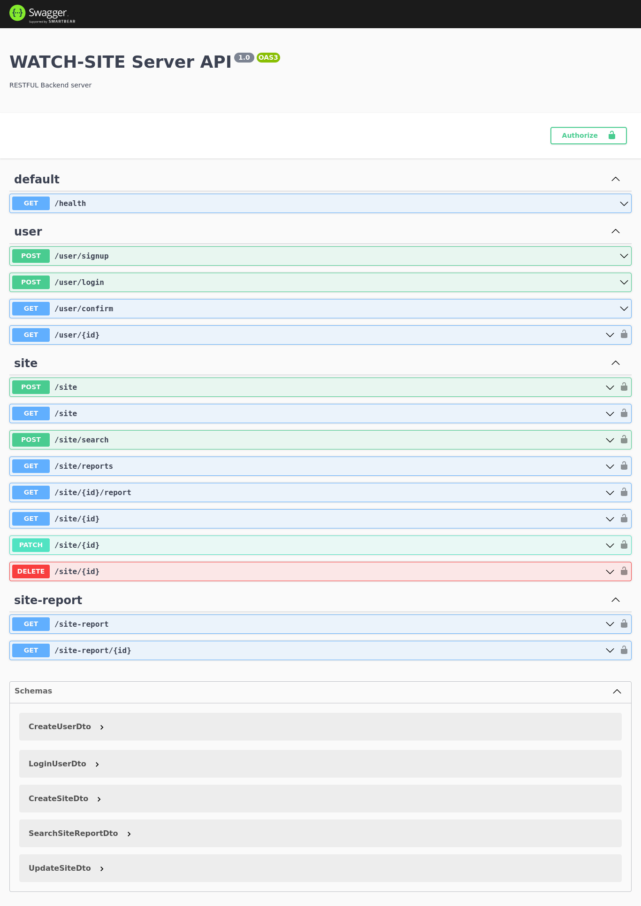

# Watch-site
 Watch site is an uptime monitoring RESTful API server that allows authenticated users to monitor URLs, and get detailed uptime reports about their availability, average response time, and total uptime/downtime in a given period of time.


## Stack

- Backend Framework: NodeJS
- Language: TypeScript
- Server Framework: NestJS
- Database: PostgreSQL
- Testing Framework: JestJS
- API Documentation: Swagger


- Functions documentations:
```ts
/** Does something interesting
* 
* @param Place $where Where something interesting takes place
* @param integer $repeat How many times something interesting should happen
*
* @throws Some_Exception_Class If something interesting cannot happen
* @return Status
*/
```

### Context:

- [x] Signup with email verification. 
- [x] CRUD operations for URL checks (`GET`, `PUT` and `DELETE` can be called only by the user user who created the check). 
- Authenticated users can receive a notification whenever one of their URLs goes down or up again:
  - Email.
  - Webhook *(optional)*.
- Authenticated users can get detailed uptime reports about their URLs availability, average response time, and total uptime/downtime.
- Authenticated users can group their checks by tags and get reports by tag.

VISIT: [TASK.md](./TASK.md) FOR MORE DETAILS


## System design diagram


## API



<hr/>
VISIT: [API.md](./API.md) FOR MORE DETAILS

## Installation

```bash
$ npm install --legacy-peer-deps
```

### Database Setup
1. Make sure you are having mongodb installed on your machine or in cloud & running server.
2. Configure the mongodb connection string in `config/env/dev.env` file.

Make sure to configure all the environment variables in `config/env/dev.env` file.

## Running the app

```bash
# development
$ npm run start

# watch mode
$ npm run start:dev

# production mode
$ npm run start:prod
```

## Test

#### Tests are not yet implemented but the test strategy is as follows:
- Unit tests for all the services and controllers.
- Create a mock-server for testing the DOWNS/UPS notifications.

```bash
# unit tests
$ npm run test

# test coverage
$ npm run test:cov
```
